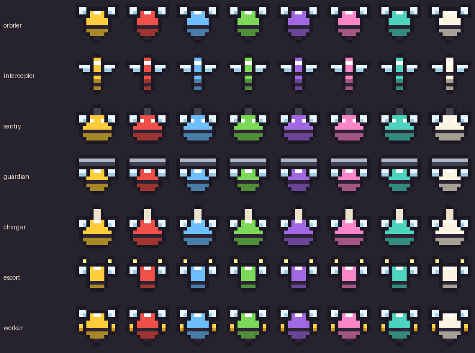

# Build a Swarm: Pixel Reskin (Draft 2)

This draft changes the arena's visuals only (floor, bees, enemies, projectiles, pickups, hive, weapon). The UI is not included. Draft 2 is redone to match BACKLOG.md: the shape book, the 2D GUI arena and the 860k client ceiling.


## Bees follow the shape book



| Shape book rule | How the pixel version keeps it |
|---|---|
| **SHAPE = behaviour**, one silhouette each | 6 silhouettes plus the Worker, each still readable at 24px |
| **COLOUR = element** | Each bee is drawn once in two layers. The body layer is white and grey, so `ImageColor3` turns it into any element colour. The outline, band, wings and eyes stay untinted. Every palette in BeeShapes works without any new art. |
| **PAINT = rarity** | Rare gets a shine overlay, Epic an aura ring, Legendary a gold aura plus a crown |
| **Wings at head level, rectangles** | Yes, on every shape |
| **Five parts** (wings, block, band, stinger) | Every bee is exactly these, plus at most one part for its role |
| **LOD: no face below ~30px** | Fight sprites only have 2 pixel eyes. The full faces belong to the icons, in the UI pass |

My guess at which bee type gets which shape (please correct):

| Silhouette | Role part | Probably |
|---|---|---|
| `orbiter` | none | Gunner |
| `interceptor` | needle body, swept wings | Stinger |
| `sentry` | barrel out front | Sniper |
| `guardian` | metal shield plate | Warden |
| `charger` | lance horn | Lancer |
| `escort` | glowing antenna bulbs | Signal |
| `worker` | pollen baskets | Worker (replaces the Looter ship, item 19b) |

## Everything else

- **Enemies:** `enemy_ant`, `enemy_beetle`, `enemy_spider`, `enemy_wasp`, `enemy_slime`, `enemy_ironback` (the Carapace siege enemy, with a mortar on its back), `boss_beetle`. Each has 2 walk frames. **These names are placeholders.** I need the 14 species and 5 bosses from GameConfig to draw the rest and name them properly.
- **Shots:** `shot_bee` (tinted to the bee's element), `shot_cannon` (your weapon), `shot_boss`, `shot_siege` (the Ironback shell the Warden blocks), `shot_acid`
- **Pickups:** `pollen_s`, `pollen_m`, `pollen_l` (so merged orbs visibly grow), `pickup_honey`
- **Effects:** `fx_spark` (hit), `fx_poof` (death), 2 frames each
- **Hive:** `hive`, `weapon_cannon` (Gunner's single cannon, pivots from its centre so `Rotation` aims it), `ring` (the damage ring)
- **Arena:** `arena_bg.png` is the whole floor baked into **one** image: grass border, stepped dirt clearing, trees, bushes, rocks and flowers. Separate ground tiles are included in case you'd rather build it from tiles.

## Files

| Path | What it is |
|---|---|
| `art/upload/atlas.png` | **Upload.** Every unit, shot, pickup and effect in one 256x102 image |
| `art/upload/arena_bg.png` | **Upload.** The arena floor (480x270) |
| `art/preview/` | Mockup, sprite sheet, and every bee shape in every element |
| `src/PixelArt/` | Luau module (ModuleScript + generated `Atlas`) |
| `tools/generate_sprites.py` | Where every sprite is drawn. Edit, run `python3 tools/generate_sprites.py`, and all the art and the Luau atlas table regenerate |

## Hooking it up

1. Copy `src/PixelArt` to `src/ReplicatedStorage/PixelArt` in the Rojo project and **restart Rojo** (new `$path` entries don't sync on a live session, LESSONS #13). Do it in the **DEV place**.
2. Upload `atlas.png` and `arena_bg.png` **under the same owner as the experience** and paste the ids into `PixelArt.ATLAS_ID` and `PixelArt.ARENA_ID`. An asset the experience can't access never renders.
3. Swap the art at these points:

```lua
local PixelArt = (function() return require(ReplicatedStorage.PixelArt) end)()

-- Arena floor, replacing the brown lanes (ZIndex 1):
PixelArt.arena(arenaFrame)

-- Bees. This is BACKLOG step 3: the server sends only the type name and the
-- client builds the bee, instead of mirroring kit sprite sheet templates.
local bee = PixelArt.newBee("sentry", palette.Body, "Epic", arenaFrame, zBand)
bee.Position = UDim2.fromOffset(x, y)
bee.Rotation = PixelArt.snapRotation(heading)

-- Enemies, shots, pickups (1 ImageLabel each):
local bug = PixelArt.new("enemy_beetle", arenaFrame)
PixelArt.animate(bug, "enemy_beetle", 6)
local shot = PixelArt.newShot(palette.Body, arenaFrame)
```

## Performance

- **Fewer instances per unit.** An enemy is 1 ImageLabel. A bee is 3 (a Frame plus 2 layers), against up to 9 Frames for a primitive built bee. Twelve bees go from about 100 instances to about 36.
- **One texture.** Every unit shares `atlas.png`, and the whole floor is one image instead of lanes plus decorations.
- **Animation costs almost nothing.** A frame change only moves `ImageRectOffset`, and one Heartbeat drives every sprite.
- **Zero client characters.** PixelArt is its own ModuleScript and the atlas table is generated, so new sprites never touch the 860k ceiling.
- **It won't fix item 19a on its own** (enemies stepping at 2x/3x). That needs draw pass interpolation. Don't snap sprite positions to the pixel grid, or the stepping will look worse.

## Open questions for Kash

1. The 14 enemy species and 5 bosses: names and a one line look for each (or paste the GameConfig enemy table).
2. The 8 palettes in BeeShapes, so the previews use the real element colours.
3. Is the bee to shape mapping above right?
4. Weapons for the other classes (Prism railgun, Queen Scepter honey dipper, Freezer, ULTRA's all-sides cannon) can be pixel sprites the same way. Should I do them next?
