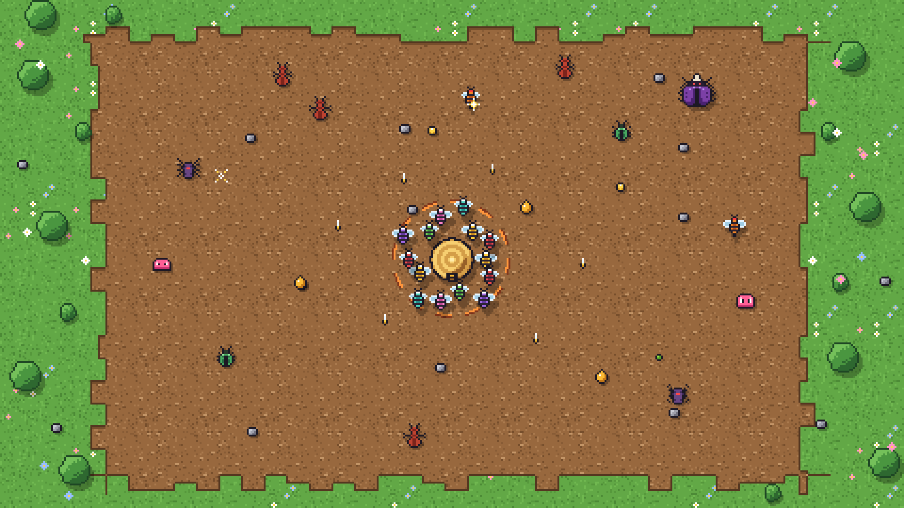

# Build a Swarm: Pixel Reskin (Draft 1)

This draft changes the game's visuals only (ground, bees, enemies, projectiles, hive, effects) to match the pixel style of the reference game. The UI is not included yet.



## What's here

| Path | What it is |
|---|---|
| `art/preview/mockup.png` | A full 1080p frame of the reskinned game |
| `art/preview/sprite_sheet.png` | Every sprite enlarged and labeled |
| `art/upload/atlas.png` | **Upload this.** Every bee, enemy, projectile, pickup and decoration in one 256x38 image |
| `art/upload/tile_grass.png`, `tile_dirt.png`, `tile_meadow.png` | Ground tiles, 32x32 (for a 2D ScreenGui playfield) |
| `art/upload/*_x8.png` | The same tiles plus the hive and ring, scaled up 8x (for 3D parts, see below) |
| `src/PixelArt/` | Luau module: draws any sprite by name, animates it, and builds the ground |
| `tools/generate_sprites.py` | Where every sprite is drawn. Change a color or pixel, rerun it, and everything above regenerates |

## Sprite list

- **Bees:** `bee_yellow`, `bee_red`, `bee_purple`, `bee_green`, `bee_pink`, `bee_teal` (2 frames of wing flap each)
- **Enemies:** `enemy_ant`, `enemy_beetle`, `enemy_spider`, `enemy_wasp`, `enemy_slime` (the pink cube, redone in pixels), `boss_beetle` (2 walk frames each)
- **Projectiles and effects:** `proj_stinger`, `proj_pollen`, `proj_acid`, `fx_spark` (2 frames), `pickup_honey`
- **World:** `hive`, `ring` (the damage ring), `deco_tree`, `deco_bush`, `deco_rock`, `deco_flower_white/pink/blue`, ground tiles `grass`, `dirt`, `meadow`

I named these from what I could see in your screenshots. Once I see the game's code, I'll rename them to match your real bee and enemy types.

## Hooking it up

1. Copy `src/PixelArt` into your Rojo project (for example `src/ReplicatedStorage/PixelArt`). Rojo syncs it as a ModuleScript with an `Atlas` child.
2. Upload `art/upload/atlas.png` and paste the asset id into `PixelArt.ATLAS_ID` in `init.luau`.
3. Swap the art at the spots where the game creates each visual:

```lua
local PixelArt = require(ReplicatedStorage.PixelArt)

-- 2D playfield (ScreenGui):
local bee = PixelArt.new("bee_purple", playfield)
PixelArt.animate(bee, "bee_purple", 10)
bee.Rotation = PixelArt.snapRotation(angle)

-- 3D parts with a top down camera:
PixelArt.attach(enemy.PrimaryPart, "enemy_beetle")
PixelArt.floorTexture(workspace.Arena.Floor, "rbxassetid://<tile_dirt_x8 id>")
```

**Why it matters whether the game is 2D or 3D:** a GUI image can use `ResamplerMode.Pixelated`, which keeps each pixel perfectly square. A 3D `Texture` or `Decal` can't use that setting, so Roblox would blur the pixels. That's why the `_x8` versions exist: when the image is already 8x bigger, the blur is too small to notice.

## Performance

Pixel art by itself doesn't make a game faster. How it gets drawn is what makes the difference, and this setup is built for that:

- **One texture for everything.** Every unit shares `atlas.png`, so the client downloads one tiny image instead of dozens of meshes, decals or high resolution images.
- **Animation is free.** Changing frames only moves a crop rectangle on the same image. Nothing gets created or destroyed.
- **One update loop.** A single `Heartbeat` connection animates every sprite, instead of one loop or tween per bee.
- **Flat sprites instead of meshes and particles.** If the bees and bugs are currently meshes, or use glow and particle effects, swapping them for flat sprites is where most of the speedup will come from.

## Next steps

- Look through the real game code and map each bee and enemy type to its sprite.
- Adjust `PixelArt.SCALE` or `STUDS_PER_PIXEL` so the sprites fit the arena at the right size.
- Add death frames, a hit flash and boss variants as needed.
- Reskin the UI to match (a separate pass).
